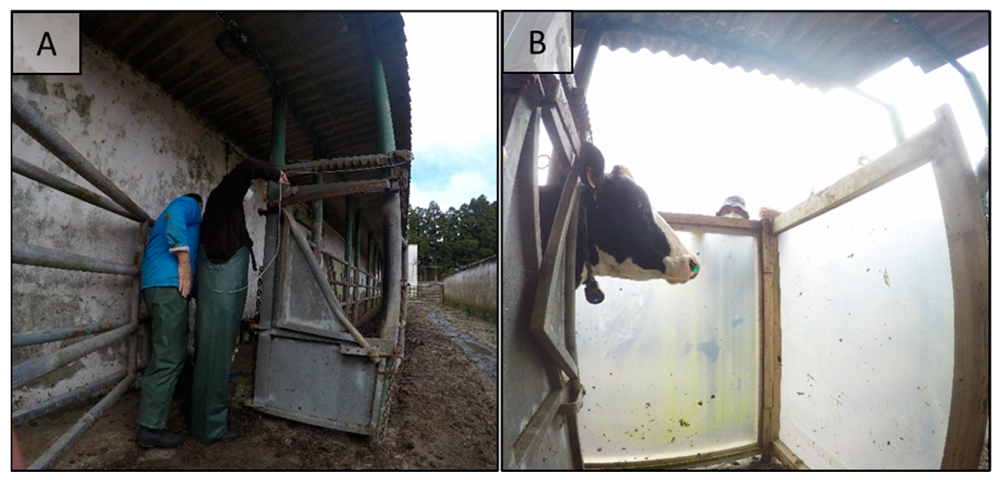
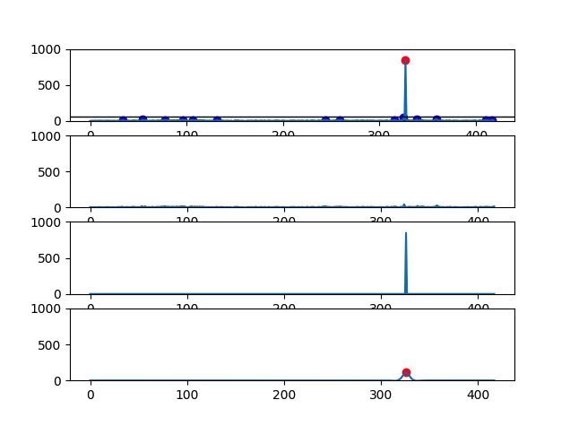
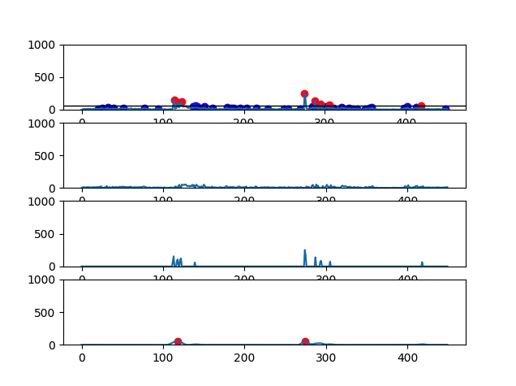
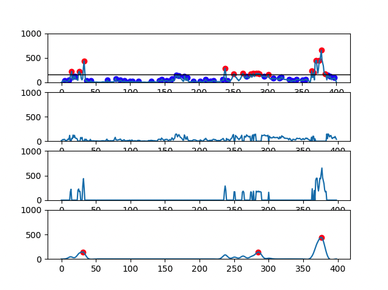
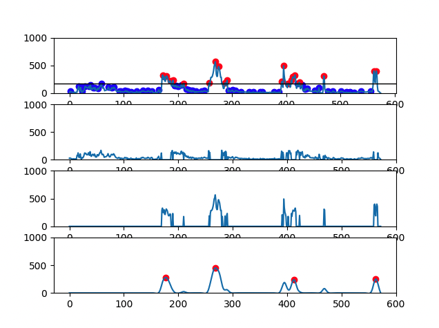

# methane-analysis

This repository contains the code used to analyze the methane emissions produced by cows grazing freely and measured using the LMD.

The purpose of this code is  to measure methane emissions from dairy cows (Jersey and Holstein-Freisian raised under a semi-extensive management system) with a tool that is described as reliable, portable, and cost-effective: the laser methane detector (LMD). 

The setup for the LMD measurement is shown in the following figure (all measurements were gathered in the same location - Angra do Heroísmo, Terceira Island, Azores, Portugal):



Caption:

- A: Handling race with a cattle head holder at the end for cattle contention.
- B: Positioning of wind protection panels during an LMD measurement (laser is visible as a green dot in the right nostril).

The article that describes the overall final analysis that was performed is available [here](https://www.mdpi.com/2076-2615/13/6/974).

## Table of Contents

- [Requirements](#requirements)
- [Data](#data)
- [Analysis](#analysis)
- [Results](#results)

## Requirements

The analysis is performed using Python 3.9. The required packages are listed in the `requirements.txt` file.

1. Installing Python:

    - On Windows, download the latest version of Python from [here](https://www.python.org/downloads/windows/). Then, run the installer and follow the instructions.
    - On macOS, download the latest version of Python from [here](https://www.python.org/downloads/mac-osx/). Then, run the installer and follow the instructions.
    - On Linux, run the following commands in a terminal:

        ```bash
        sudo apt update
        sudo apt install python3.9
        ```

2. Installing the required packages:

    - On Windows, open a command prompt and run the following command:

        ```bash
        python -m pip install -r requirements.txt
        ```

    - On macOS and Linux, open a terminal and run the following command:

        ```bash
        python3.9 -m pip install -r requirements.txt
        ```

## Data

The data to be used for the analysis must be placed under the `analysis/data` folder. The data must be stored in CSV files. The CSV files must have the following format (as generated by the LMD devide):

```csv
Alarm Level :,1000
Storage cycle [sec] :,0.5
Average :,ON
Unit :,ppm-m
Distance [m] :,

No,yyyy/mm/dd hh:mm:ss.s,Intensity,Measured Value,Error,Location
1,2023/06/13 10:55:49.3,589,3,1,No data
2,2023/06/13 10:55:49.8,614,8,1,No data
3,2023/06/13 10:55:50.4,599,5,1,No data
4,2023/06/13 10:55:50.8,470,6,1,No data
5,2023/06/13 10:55:51.3,430,5,1,No data
...
```

A profile file must also be provided for the final analysis to contain the information about which cows the emissions relate to. The profile file must be a CSV file with the following format:

```csv
Sample File,Cow Name
2023_06_13 105901,4
2023_06_13 114641,3
2023_06_13 115139,14
...
```

In the end, you should have a folder structure similar to the following:

```bash
analysis
├── data
    ├── 2023_06_13
        ├── data
        │    ├── 2023_06_13 105901.csv
        │    ├── 2023_06_13 105901.csv
        │    └── ...
│       └── profile.csv
    ├── 2023_06_14
        ├── data
        │    ├── 2023_06_14 115225.csv
        │    ├── 2023_06_14 107263.csv
        │    └── ...
│       └── profile.csv
    └── ...
methane.py
```

## Analysis

The analysis is performed in the `methane.py` file. To run the analysis, open a terminal and run the following command:

```bash
python3.9 methane.py -f <FOLDER> -c <COW_NAME_CSV>
```

Example to run the analysis for the 2023_06_13 folder exemplified above:

```bash
python3.9 methane.py -f analysis/2023_06_13/data -c analysis/2023_06_13/profile.csv
```

## Results

The results of the analysis are available in the folder where the analysis (under the `data` folder) was run. The following results will be available:

- `aggregate.csv`: contains the aggregated results - concatenation of all csv files.
- `stats.csv`: contains the statistics of the aggregated results.
- `graphs/` folder: contains the analysis graphs.

There are 4 graphs generated for each file:

- First graph has the signal plot with all identified CH4 peaks (red dots and blue dots correspond, respectively, to eructation and respiratory CH4 peaks)
- Second graph has the plot of CH4 respiratory peaks
- Third graph has the plot of CH4 eructation peaks
- Fourth graph has the plot of the calculated eructation events after processing

Example of the graphs generated:

- Cow with 1 eructation event:



- Cow with 2 eructation events:



- Cow with 3 eructation events:



- Cow with 4 eructation events:

